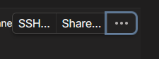

# tailscale-config

klo blm ada curl install dl:
```
sudo apt update
sudo apt install curl
```

Trs klo udh install curl jalanin ini:
```
curl -fsSL https://tailscale.com/install.sh | sh
```

trs ini
```
sudo tailscale up
```

--> nanti disuruh login gt ntr login aja

## Navigasi di Web ny
ntr bakalan ada device yang kedaftar gt kek gini:

Habistu jalanin ini di raspy buat enable ssh:
```
tailscale set --ssh
```

ntr bakalan muncul ini:


Ada stiker SSH Hijau

Habistu pencet share :



Share aja lewat link trs kasih ke WA gw